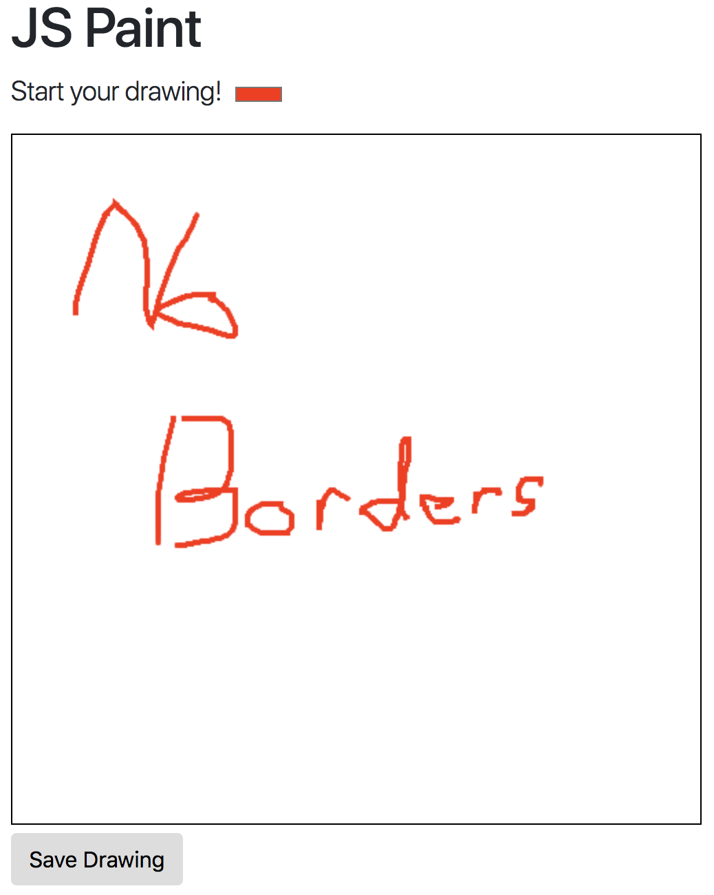

# Problem C

In this exercise, you will practice working with event-driven programming to create an interactive drawing application!

To complete the exercise, edit the included **`js/index.js`** file to add in the code described in the comments. Note that you should ___not___ edit the HTML file!

You can see the results of your work by opening up the included `index.html` file in a browser. Remember to refresh the page after you update your code, and to check for any errors in the Developer console.

**A note on testing** The provided test suite does not check your page's functionality (since this application is highly interactive). Instead, it will check that you have saved an application drawn with the image into the `img/` folder.